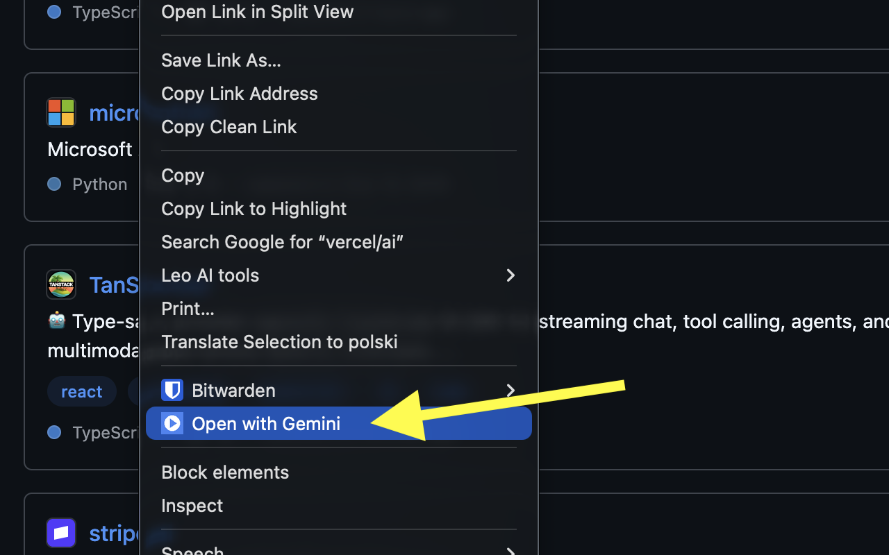

# Open with Gemini

A Chrome extension (Manifest V3) that adds "Open with Gemini" to the right-click
menu. Right-click any link — a video in a feed, an article, a search result — and it
opens Google Gemini in a new tab with your prompt and the link already typed in.

No copying the URL. No opening the page first. No switching tabs to paste.

## Features

- **Right-click any link** → "Open with Gemini" (main use case: links in a list,
  without opening them)
- **Toolbar icon** → sends the page you're currently on
- **Custom prompt template**, editable in the extension options; use `{url}` as the
  placeholder for the link
- **You decide when it sends** — by default the prompt is filled in and waits for you
  to press Enter; an optional *Send automatically* setting submits it for you



## Install (development)

```bash
git clone https://github.com/michaljonik/open-with-gemini.git
```

1. Open `chrome://extensions`
2. Enable **Developer mode** (top right)
3. Click **Load unpacked** and select the `extension/` folder

## Configure the prompt

Right-click the extension icon → **Options**, or go to `chrome://extensions` →
Details → Extension options.

The template must contain `{url}`. Examples:

```
Summarize this: {url}
Transcribe this video and list the key points: {url}
What are the main arguments in this article? {url}
```

Templates are stored in `chrome.storage.sync`, so they follow your signed-in Chrome
profile.

### Send automatically (experimental)

The same options page has a **Send automatically** checkbox, off by default. With it
on, the extension submits the prompt instead of leaving it for you to send.

It's marked experimental for a reason: submitting means simulating an Enter keypress
on Gemini's input, and falling back to clicking the Send button if that doesn't take.
Both depend on Google's page internals and can break when the interface changes. When
that happens the extension degrades quietly — the prompt is still typed into the box,
you just press Enter yourself, exactly as with the setting off.

## How it works

Gemini has no URL parameter for pre-filling a prompt, so the extension does it with a
content script scoped to `gemini.google.com`:

1. `background.js` (service worker) reads the link URL from the context-menu event,
   builds the prompt from your template, and stashes it in `chrome.storage.session`.
2. It opens a new tab to `https://gemini.google.com/app`.
3. `content.js` runs on that page, reads the pending prompt, waits for Gemini's input
   field to render (`MutationObserver` — it's an SPA, the field isn't there on load),
   and types the text in using native input events.
4. If *Send automatically* is on, it waits for the Send button to become enabled,
   dispatches an Enter keydown/keyup, and a second later checks whether the input
   cleared. If the text is still sitting there, it clicks the Send button instead.

Two non-obvious details worth knowing before you touch the code:

- Gemini's input is an Angular/Lit-managed `contenteditable` div. Setting
  `.textContent` directly is silently ignored — you need `execCommand("insertText")`
  plus a real `InputEvent` so the framework's internal state updates.
- `chrome.storage.session` defaults to trusted contexts only, so a content script
  reading it throws *"Access to storage is not allowed from this context."* The fix is
  `setAccessLevel({accessLevel: "TRUSTED_AND_UNTRUSTED_CONTEXTS"})` from the service
  worker — and it **resets on every browser restart**, so it's called in both
  `onInstalled` and `onStartup`.
- The Send button stays disabled until Angular registers the injected text, and until
  then Gemini ignores a synthetic Enter too. So auto-send waits for that button to flip
  to enabled *before* trying anything — the same Enter that does nothing immediately
  after typing works fine a moment later.
- Don't identify the Send button by `aria-label`: it's localised (it reads "Wyślij
  wiadomość" in Polish). The stable hook is its Material icon,
  `mat-icon[fonticon="arrow_upward"]`, which is the same in every language.
- Never click a Send button reference you resolved earlier. Once the reply starts
  streaming, Angular turns that same DOM node into the Stop button — clicking the
  stale reference aborts the message you just sent. The fallback re-resolves by icon,
  so a button that has become Stop simply doesn't match.

## Permissions

| Permission | Why |
|---|---|
| `contextMenus` | Adds the right-click menu entry |
| `activeTab` | Reads the current tab's URL when you click the toolbar icon (narrower than `tabs` — only on explicit click) |
| `storage` | Saves your prompt template and auto-send preference; passes the pending prompt to the Gemini tab |
| `https://gemini.google.com/*` | Types the prompt into Gemini's input field |

No access to other sites. No remote code. No analytics. See [PRIVACY.md](PRIVACY.md).

## Troubleshooting

**Nothing happens when the Gemini tab opens.** Google changed the UI and the input
selector no longer matches. Open DevTools on `gemini.google.com/app`, find the current
prompt field (look for `contenteditable` or `rich-textarea`), and update `findInput()`
in `content.js`. If you fix it, a PR is very welcome — this is the one part of the
extension that breaks on Google's schedule, not mine.

**"Access to storage is not allowed from this context."** Reload the extension in
`chrome://extensions` — the session storage access level needs the service worker to
have run `onInstalled`/`onStartup`.

**The prompt is typed in but not sent, with *Send automatically* on.** Google changed
either the key handling or the Send button markup. The prompt is still there, so
nothing is lost — press Enter. To fix it properly, check `trySend()` and
`waitForSendButton()` in `content.js`.

## License

MIT
